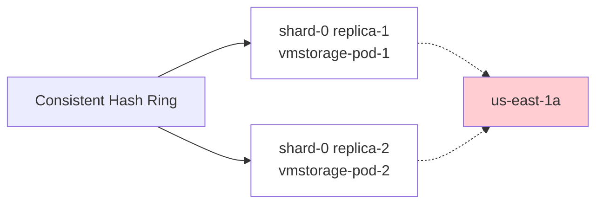
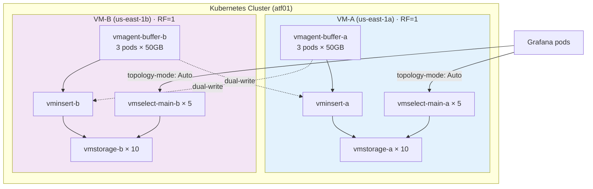
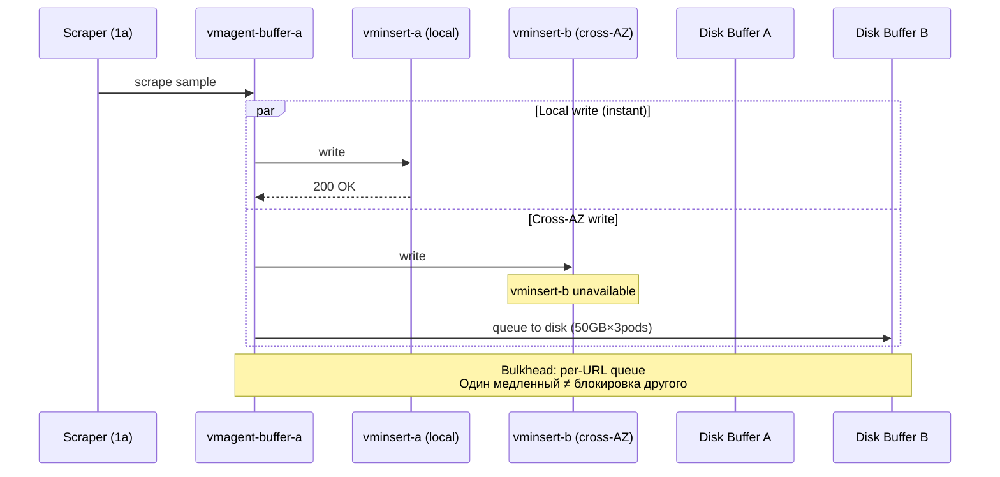
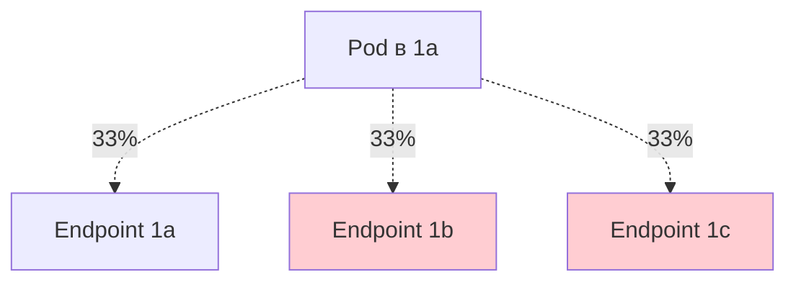
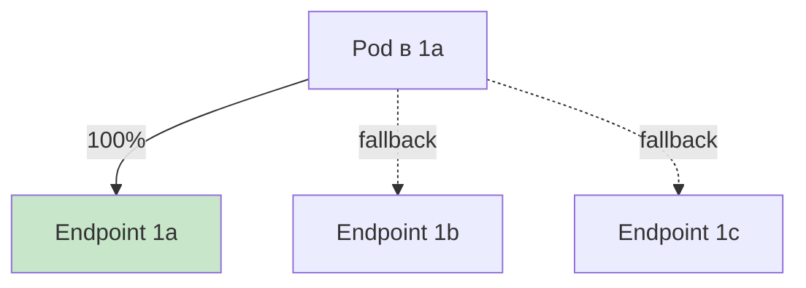
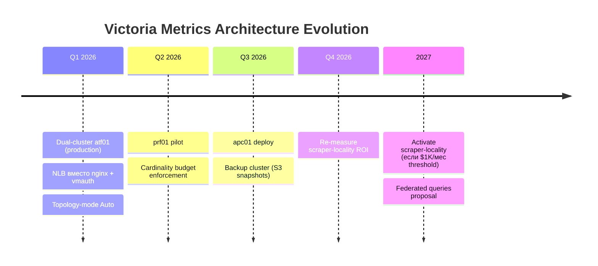

<!-- _class: lead -->
<!-- _paginate: false -->

# Victoria Metrics Multi-AZ
## AZ-Level DR без Replication Tax

**Dmitrii Rassvetalov**
IT Production · Playrix
KubeCon EU 2026

---
**В продакшене:** atf01 · 111M active series · 1.66M samples/sec

> *"RF=2 защищает от потери ноды. AZ — это другая проблема."*

---

## О чём этот доклад

<div class="columns">

<div>

### 🎯 Проблема
RF=2 удваивает write I/O,
**не давая** AZ-level DR

### 💡 Решение
Два независимых RF=1 кластера
с dual-write на vmagent layer

</div>

<div>

### 📊 Результат
- Cross-AZ read: **3 hops → 0**
- Failover: **5-15s автомат**
- RPO=0 в окне **<5 мин**
- Net cost: ~−$320/мес

### 🎓 Урок
Cost ≠ единственная метрика.
**DR + simplicity** тоже ценность.

</div>

</div>

---

## Проблема: RF=2 — это не AZ-DR

[VictoriaMetrics Issue #4216](https://github.com/VictoriaMetrics/VictoriaMetrics/issues/4216):
**Consistent hash игнорирует AZ labels** при выборе replicas.



При неудачной hash-распределении **обе replicas** оказываются в одной AZ.
**AZ outage → потеря данных, несмотря на RF=2.**

---

## Скрытые расходы RF=2

<div class="columns">

<div>

### 💰 Cross-AZ read tax
vmselect fan-out на 20 нод × 3 AZ:
- Каждый query = 14 cross-AZ hops
- **~$900/мес** AWS egress

### 🧠 Memory pressure
- vmselect держит state по 20 нодам
- OOM во время compaction bursts
- Risk: upsize до r7g.4xlarge

</div>

<div>

### ⚙️ Write I/O ×2
- Каждый sample → 2 vmstorage
- **+$400/мес** на storage I/O
- Compaction load удваивается

### 🚨 Operational burden
- Manual intervention при AZ outage
- Сложный recovery procedure
- Trust в систему — пострадал

</div>

</div>

---

## Решение: Dual Independent Clusters



Каждый кластер хранит **100% данных** (RF=1, dual-write на application layer)

---

## Dual-Write: Bulkhead Pattern



**Гарантия:** недоступность одного upstream НЕ блокирует другой.

---

## Kubernetes Topology-Mode: Auto

<div class="columns">

<div>

### ❌ Без annotation

67% cross-AZ → **$900/мес**

</div>

<div>

### ✅ С `topology-mode: Auto`

0% cross-AZ → **$0/мес**

</div>

</div>

> ⚠️ **Silent deactivation:** при skew >3× hints отключаются БЕЗ алертов.
> Mitigation: proactive alert при 2.5× (см. Monitoring slide)

---

## NLB вместо nginx Ingress + vmauth

| Аспект | nginx + vmauth (старое) | NLB L4 (новое) |
|---|---|---|
| Слой | L7 (HTTP) | L4 (TCP) |
| Body buffering | ⚠️ Buffers request body | ✅ Pass-through |
| Latency overhead | Variable (load-dependent) | Минимальный |
| Graphite (TCP :2003) | ❌ Не поддерживается | ✅ Native |
| AZ awareness | Нет | `cross_zone=false` |
| SPOF | Один nginx instance | NLB node per AZ |

> **Note:** vmauth теперь sidecar на vminsert pod (не в request path для internal queries)

---

## Health Check: HTTP vs TCP

```hcl
health_check {
  protocol            = "HTTP"           # ✅ Не TCP!
  path                = "/api/v1/write"
  matcher             = "204"
  interval            = 5
  unhealthy_threshold = 2                # ~10s failover
}
```

**Почему HTTP, а не TCP?**
- TCP check проходит, если порт открыт — но vminsert может быть **зависший**
- HTTP check проверяет реальный response (204 = ready to write)
- Catches hung processes, OOM, deadlocks

> 💡 **NLB TCP idle timeout** теперь **configurable** (с Sept 2024, ранее hardcoded 350s).
> Для batch Graphite clients: `tcp_idle_timeout_seconds = 600`

---

## Результаты — Честные Числа

| Component | Before (RF=2) | After | Delta |
|---|---|---|---|
| Cross-AZ read egress | ~$900/mo | ~$0 | <span class="savings">−$900</span> |
| Write I/O ×2 → ×1 per cluster | $400 | $0 | <span class="savings">−$400</span> |
| Cross-AZ write (dual-write) | — | +$950 | <span class="cost">+$950</span> |
| EBS for vmagent buffers | — | +$30 | <span class="cost">+$30</span> |
| **Net cash savings** | | | **<span class="savings">−$320/mo</span>** |

<div class="key-insight">

🎯 **Это инвестиция в DR, а не оптимизация cost.**
Если нужна экономия — cardinality reduction даёт лучший ROI ($X/мес за 3 мес).

</div>

> Earlier drafts claimed "−$1,630/mo" — это было ошибочно. Vmselect "20→10" не работает (dual-cluster = 10+10 = 20 нод итого).

---

## Failover: Empirical Timing

```mermaid
gantt
    title AZ-1a Outage Timeline
    dateFormat X
    axisFormat %s
    
    section Detection
    Packet loss begins     :0, 5
    Kubelet probes fail    :5, 10
    
    section Write Path
    EndpointSlice update   :5, 15
    kube-proxy fallback    :15, 20
    NLB health check       :10, 20
    Buffer queues for vm-a :20, 300
    
    section Read Path  
    Grafana fallback to b  :5, 15
    NLB removes 1a targets :10, 20
    
    section Recovery
    AZ-1a restores         :3600, 3610
    Health checks pass     :3610, 3620
    Buffer drains 50MB/s   :3620, 6020
```



**Empirical RTO: 5-15 секунд** (не <100ms!) · Validated on production

---

## Failover: Что Видит Grafana

| Состояние | Query freshness | Lag |
|---|---|---|
| 🟢 Normal (оба кластера) | <1s | Real-time |
| 🟡 1a down, buffer-b drains | <5min | Acceptable for SLI |
| 🟠 Buffer >180GB (rate-limited) | <10min | Degraded but available |
| 🔴 Both clusters down | N/A | Backup nedoor (не RPO=0) |

<div class="key-insight">

⚠️ **"RPO=0" ≠ "zero lag".** Define your freshness SLA explicitly.
Acceptable for SLI dashboards, NOT for billing systems.

</div>

---

## "Но как же..." — Преэмптивный FAQ

<div class="columns">

<div>

### Q1: RF=1 = потеря 10% данных?
**A:** Нет. `isPartial: true` flag + PDB (`minAvailable: 9`) предотвращает.

### Q2: Дубликаты от dual-write?
**A:** 0.1-0.5% (timestamp jitter), `vmstorage dedup` снимает.

### Q3: Если оба кластера упадут?
**A:** RPO=0 — для одной AZ. Backup = отдельная задача.

</div>

<div>

### Q4: Cardinality удваивается?
**A:** Нет — это write amplification, не cardinality.
**111M в каждом кластере**, не 222M.

### Q5: NLB 350s timeout?
**A:** Configurable с Sept 2024.
Pre-deploy: SO_KEEPALIVE < 300s.

### Q6: vmctl backfill для historical?
**A:** Phase 3 of migration.
50 MB/s rate-limited.

</div>

</div>

---

## Production Monitoring (Critical Alerts)

```yaml
- alert: TopologyHintsDeactivated      # Cross-AZ traffic вернулся МОЛЧА
  expr: kube_endpointslice_annotations{...topology_mode="Auto"}
        unless on(endpointslice) {...hints_auto="yes"}
  severity: critical

- alert: VmagentBufferHighFill         # Risk потери при переполнении
  expr: vmagent_remotewrite_pending_data_bytes / (50 * 1024^3) > 0.7
  severity: warning

- alert: VMCardinalityBurst            # Новая игра / misconfig
  expr: rate(vmagent_active_series[5m]) > 1.2 * baseline
  severity: warning

- alert: TopologyHintsInactivePreventive  # Fire BEFORE silent deactivation
  expr: pod_to_node_ratio_per_zone > 2.5
  severity: warning
```

---

## Когда НЕЛЬЗЯ применять эту архитектуру

<div class="columns">

<div>

### ❌ Не подойдёт:
- **Billing systems** — нужна полная consistency
- **Single-AZ кластеры** — нет смысла
- **<50M active series** — RF=2 проще
- **Нет K8s discipline** — PDB, alerts must

</div>

<div>

### ✅ Идеален для:
- **100M+ active series**
- **3+ AZ в кластере**
- **<5min lag acceptable** (SLI ОК)
- **Production-grade ops** (monitoring, runbooks)

</div>

</div>

> **Сегодня deployed:** atf01 (production)
> **Pilot:** prf01 (Q2 2026)
> **Planned:** apc01 (Q3 2026)

---

## 5 Ключевых Уроков

1. **Zone awareness в consistent hash = хард проблема.**
   Dual-cluster проще, чем fix in upstream.

2. **L7 proxies прячут locality.**
   NLB (L4) делает её явной и автоматической.

3. **Bulkhead pattern спасает при cascade failures.**
   Per-URL disk buffers = изоляция failure domains.

4. **Consistency SLAs должны быть явными.**
   "RPO=0" ≠ "zero lag". Define freshness windows.

5. **Empirical validation > assumptions.**
   topology-mode fallback = 5-15s, не <100ms. Validate yourself.

---

## Что Дальше — Roadmap



---

## Спасибо! · Q&A

<div class="big-number">?</div>

**Dmitrii Rassvetalov**
📧 vstahanov@gmail.com
🌐 github.com/rassvetalov-d
💼 linkedin.com/in/dmitriy-rassvetalov-92297458

**Полные материалы:**
- 📄 Case studies: `github.com/rassvetalov-d/portfolio/case-studies/`
- 🛠️ Production code: `github.com/Playrix/itprod-docker`

> "Не платите дважды за то, что не получили."
