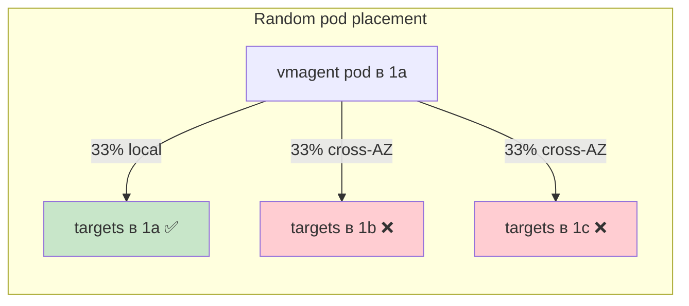
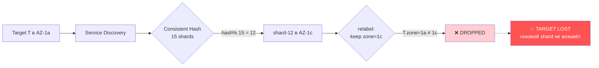
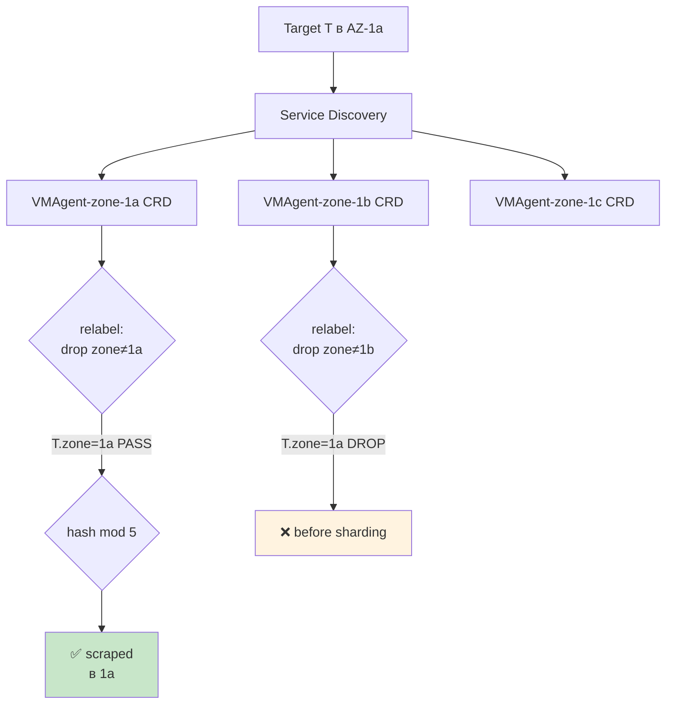
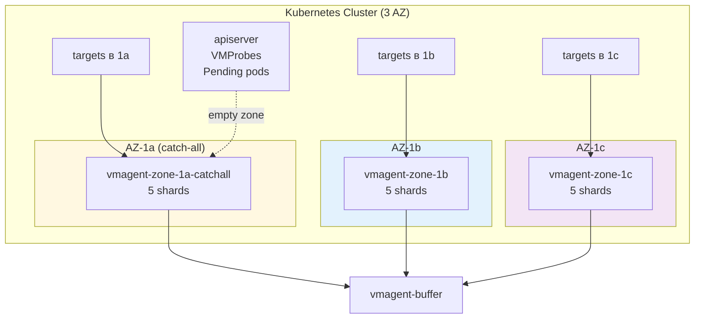
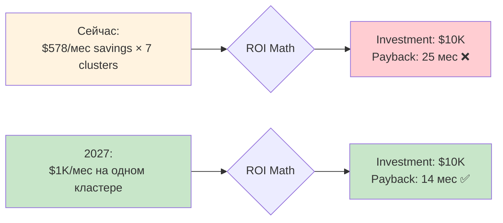
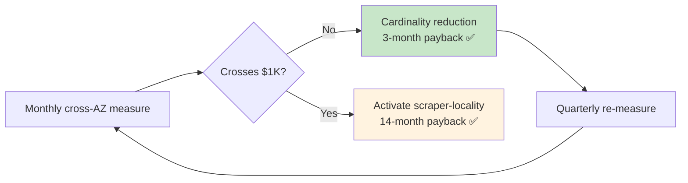

<!-- _class: lead -->
<!-- _paginate: false -->

# Scraper Locality
## Когда $578/мес становится проблемой

**Dmitrii Rassvetalov**
IT Production · Playrix
KubeCon EU 2026 · FinOps Track

---
**7 кластеров** · ~$578/мес cross-AZ scrape baseline · ROI Discipline

> *"Не всё, что можно оптимизировать, нужно оптимизировать СЕЙЧАС."*

---

## Главная Мысль (теперь, чтобы не ждать конца)

<div class="roi-box">

### 📊 Текущее состояние
$578/мес org-wide cross-AZ scrape (7 кластеров)
**Самый большой:** apv01 = $259/мес (ниже $1K threshold)

### 💡 Дизайн готов, не deployed
**Trigger:** когда любой кластер перейдёт **$1K/мес**

### 🎓 Главный урок
**ROI discipline > implementation excitement**

</div>

> Этот доклад — про **измерение и timing**, не про optimization.

---

## Baseline: Где Живёт Cross-AZ Трафик?

| Кластер | Shards | Scrape RX | Cross-AZ % | $ Cost/мо |
|---|:-:|:-:|:-:|---:|
| **apv01** (prod US) | 15 | 7.64 MB/s | ~67% | **~$259** ⚠️ |
| prf01 (perf US) | 15 | 2.36 MB/s | ~67% | ~$80 |
| atf01 (test EU) | 3 | 2.13 MB/s | ~67% | ~$108 |
| apc01 (prod China) | 3 | 1.51 MB/s | ~50% | ~$37 |
| adv01 (dev US) | 3 | 1.44 MB/s | ~67% | ~$50 |
| adc01, sbx01 | 3 | 1.49 MB/s | ~58% | ~$44 |
| **Total** | | | | **~$578/mo** |

> **Methodology:** AWS Cost Explorer + VPC Flow Logs (Athena). Verified 7-day avg.
> **Rate:** $0.02/GB on conversation (in + out, AWS billing reality)

---

## Почему 67%, а не 100%?



**Kubernetes scheduler не знает про AZ.**
Default kube-proxy round-robin → vmagent в любой AZ → 67% targets cross-AZ.

> **Compression note:** gzip уменьшает on-wire bytes 5-10×, AWS bills compressed.
> Real wire bandwidth: ~32% от raw scrape data.

---

## ❌ Naive Решение — Blind Spot!



**Cluster ownership** = shard-12 владеет target T (по hash).
**Relabel дропает T до scraping.**
Никакой другой shard не возьмёт T → **blind spot**.

---

## ✅ Правильное Решение — N Independent CRDs



**Каждый CRD = независимое sharding пространство.**
Relabel **до** sharding = no blind spots. ✅

---

## Архитектура: 3 CRD per Cluster



**Catch-all** забирает targets без zone label (apiserver, probes, orphans)

---

## T-Shirt Sizing

| Size | Zoned Shards | Catch-All | Storage | CPU | Memory | Use Case |
|:-:|:-:|:-:|:-:|:-:|:-:|---|
| **s** | 1 | 1 | 10Gi | 50m | 128Mi | sandbox, dev |
| **m** | 2 | 2 | 20Gi | 100m | 256Mi | test, mid-prod (default) |
| **l** | 5 | **8** | 50Gi | 200m | 500Mi | typical prod |
| **xl** | 8 | **12** | 100Gi | 500m | 1Gi | high-traffic prod |

```hcl
# Activation = 3 lines в inputs.hcl:
metrics_victoria_metrics_k8s_stack = {
  az_locality = { enabled = true, cluster_size = "l" }
}
```

> **Auto-detect AZ** через regex по `nodes_subnet_names`. Zero manual config.

---

## Edge Case: Catch-All AZ

**Targets без zone label** = `apiserver`, `VMProbe`, Pending pods

```mermaid
graph LR
    T_orphan[Target без zone label] --> CRD_A[catch-all CRD в 1a]
    T_orphan --> CRD_B[zoned 1b CRD]
    T_orphan --> CRD_C[zoned 1c CRD]
    
    CRD_A --> RL_A{drop zone=~1b\|1c}
    RL_A -->|empty не матчит| Pass[✅ PASS]
    Pass --> Scrape[scraped]
    
    CRD_B --> RL_B{keep zone=1b}
    RL_B -->|empty не матчит| Drop_B[❌]
    
    style Pass fill:#c8e6c9
    style Scrape fill:#c8e6c9
```

**Trade-off:** AZ-1a outage = gap в apiserver/probe metrics на ~5 мин.
Acceptable: при AZ outage есть проблемы поинтереснее.

---

## ROI Анализ: Делать ИЛИ Ждать?

<div class="columns">

<div class="roi-box">

### 🔴 ROI СЕЙЧАС
**Savings:** ~$405/мес (70% reduction)
**Investment:** ~$10K (design + rollout)
**Payback:** **~25 месяцев**

❌ Слишком долго

</div>

<div class="roi-box">

### 🟢 ROI КОГДА $1K/мес
**Savings:** ~$700/мес
**Investment:** ~$10K (design ready)
**Payback:** **~14 месяцев**

✅ Reasonable

</div>

</div>

> **Trigger:** ANY cluster crosses **$1K/мес** baseline (quarterly review).
> **Estimate:** apv01 hits $1K при ~4× cardinality growth → likely 2027.

---

## Альтернатива: Cardinality Reduction (Лучше ROI)

| Optimization | Savings | Investment | Payback |
|---|---:|---:|:-:|
| **Drop unused labels** | $100/мес | $1K (1 sprint) | **3 мес** ✅ |
| **Increase scrape interval** (15s→30s) | $50/мес | $0.5K | **2 мес** ✅ |
| Scraper locality (deferred) | $405/мес | $10K | 25 мес ❌ |

<div class="key-insight">

🎯 **HIGH-ROI первыми.**
Cardinality reduction даёт быстрый payback СЕЙЧАС.
Scraper locality — для будущего, когда trigger threshold перейдёт.

</div>

---

## Activation Roadmap (когда $1K/мес crosses)

```mermaid
gantt
    title Activation Plan (4 phases × ~1 week)
    dateFormat X
    axisFormat Wk%w
    
    section Phase 1
    Re-baseline cross-AZ      :0, 7
    
    section Phase 2  
    Chart bump 0.35→0.70      :7, 10
    Sandbox validation (sbx01) :10, 17
    24h soak test              :15, 17
    
    section Phase 3
    Parallel deploy (10%)      :17, 19
    Gradual: 25→50→75→100%     :19, 24
    
    section Phase 4
    Decommission old vmagent   :24, 28
    Verify 70% reduction       :26, 28
```

**Total: ~1 month operational effort** (parallel deployment + safety buffer)

---

## Operational Gotchas

<div class="columns">

<div>

### ⚠️ Operator Issue #604
- `replicaCount > 1` = duplicate scrapes
- Accept: 30-90s gap per shard rolling restart
- Mitigate when probe-load grows

### ⚠️ Cardinality Burst
- Новая игра = +50M series overnight
- Dual-write means pay 2× for cardinality
- Alert: >20% rise in 5min

</div>

<div>

### ⚠️ Static Configs
- Custom scrape configs без zone label
- Falls through to catch-all
- Audit before rollout

### ⚠️ Network Policies
- Strict policies block cross-AZ
- Test: `kubectl exec → curl other AZ`
- Common pitfall after rollout

</div>

</div>

---

## Comparison: Single vs N AZ-Aware Agents

| Аспект | Single Agent | N AZ-Aware Agents |
|---|---|---|
| Deployment | 1 StatefulSet | N CRD (3 для 3 AZ) |
| Cross-AZ cost | ~$578/мес | ~$170/мес (70% save) |
| Pod scheduling | Random across AZ | nodeAffinity per AZ |
| **Failover на pod** | 30-60s (другой shard) | 30-60s (внутри той же AZ) |
| **Failover на AZ** | ✅ Other AZ продолжит | ❌ Targets-в-той-AZ STOP |
| **Resilience** | 🟢 **Higher** (AZ loss redistributes) | 🟡 Lower (catch-all SPOF) |
| ROI threshold | n/a | **$1K/мес per cluster** |

<div class="key-insight">

🎯 **Honest trade-off:** Cost savings ↔ AZ failure resilience.
Single agent = резильентнее. N agents = дешевле (когда подходит ROI).

</div>

---

## "Почему ждём?" — Хороший Вопрос



**Discipline > excitement.** Хорошая архитектура нужна, но **в правильное время**.

---

## 4 Ключевых Урока

<div class="columns">

<div>

### 1️⃣ ROI Discipline
Не каждая оптимизация стоит реализации сейчас.
Define breakeven, wait for natural growth.

### 2️⃣ N Independent CRDs > Single Cluster
Relabel **до** sharding = no blind spots.
Architectural choice > zone-aware hashing.

</div>

<div>

### 3️⃣ Blind Spot Pattern
Common pitfall в sharded systems.
Где принимается решение — критично.

### 4️⃣ Compression Hides Real Cost
gzip уменьшает on-wire 5-10×.
AWS bills compressed bytes, not raw.

</div>

</div>

> 🎯 **Takeaway:** "Good architecture + good timing = ROI"

---

## Что Делаем СЕЙЧАС Вместо



**Quarterly:** Apr 1, Jul 1, Oct 1, Jan 1 — re-baseline cross-AZ scrape.
**Trigger:** Any cluster > $1K/мес → activate.

---

## Спасибо! · Q&A

<div class="big-number">?</div>

**Dmitrii Rassvetalov**
📧 vstahanov@gmail.com
🌐 github.com/rassvetalov-d
💼 linkedin.com/in/dmitriy-rassvetalov-92297458

**Полные материалы:**
- 📄 Design doc: `case-studies/prometheus-scraper-locality.md`
- 🛠️ Production code: `github.com/Playrix/itprod-docker`
- 🎤 Companion talk: "Victoria Metrics Multi-AZ Architecture"

> "Optimize HIGH-ROI first. Wait for the trigger to flip."
